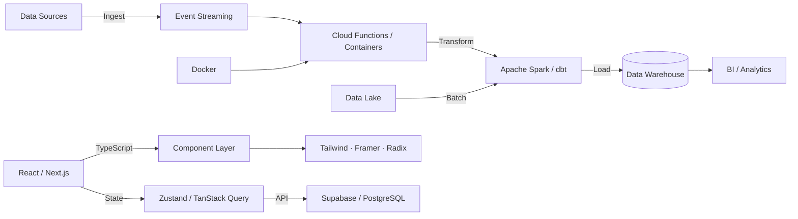

<div align="center">

<!-- ANIMATED HEADER -->


<!-- PIXEL ART FACE -->


<br/>

<!-- ANIMATED TYPING SVG -->
<a href="https://git.io/typing-svg">
  
</a>

<br/><br/>

<!-- SOCIAL BADGES -->
[](https://github.com/Eljosek)
[](https://instagram.com/eljosek)
[](https://www.linkedin.com/in/jose-miguel-herrera-guti%C3%A9rrez-841319340/)
[](mailto:josemiguelherreragutierrez7@gmail.com)

</div>

---

## 🧑‍💻 About Me

<details>
<summary>👨‍💻 <b>Ver mi carta de presentación en código</b></summary>

<br/>

```python
class JoseHerrera:
    def __init__(self):
        self.name        = "José Herrera"
        self.alias       = "Eljosek"
        self.university  = "Universidad Tecnológica de Pereira"
        self.degree      = "Ingeniería de Sistemas y Computación"
        self.focus       = [
            "Data Engineering & Cloud Pipelines",
            "Data Analytics & Business Intelligence",
            "Cloud Computing (AWS · Azure · GCP)",
            "Full-Stack Web Development",
        ]
        self.tools       = ["BigQuery", "Databricks", "Docker", "Apache Spark", "dbt"]
        self.currently   = "Building data pipelines & cloud-native apps"
        self.fun_fact    = "I automate ETL workflows before breakfast ☕"

    def say_hi(self):
        print("Thanks for stopping by! Let's build something data-driven 🚀")
```

</details>

<br/>

> ☁️ **Systems Engineering student** focused on **Data Engineering**, **Analytics**, and **Cloud Computing**. I design robust data pipelines, transform raw data into actionable insights, and ship production-grade web apps — powered by cloud-native tools across AWS, Azure and GCP.

---

## 🛠️ Tech Stack

<div align="center">

### ☁️ Cloud & Data Engineering


### 📊 Data & Analytics


### 🌐 Frontend


### 🔧 Backend & Database


### ⚡ DevOps & Tools


</div>

---

## ☁️ Cloud Data Engineering Stack

<div align="center">

```
┌──────────────────────────────────────────────────────────────────────────┐
│               ☁️  CLOUD DATA ENGINEERING STACK                          │
│           AWS  ·  Azure  ·  GCP  —  Cloud-Native Pipelines              │
├─────────────────────┬──────────────────────┬────────────────────────────┤
│  INGESTION          │  PROCESSING          │  STORAGE & ANALYTICS       │
│  ─────────────────  │  ──────────────────  │  ────────────────────────  │
│  • Event Streaming  │  • Apache Spark      │  • Data Warehouse (DWH)    │
│  • REST APIs        │  • Databricks        │  • Data Lake (Object Store) │
│  • Cloud Functions  │  • dbt (models)      │  • BI / Looker / PowerBI   │
│  • Message Queues   │  • Dataflow          │  • BigQuery / Synapse      │
├─────────────────────┴──────────────────────┴────────────────────────────┤
│  🐳 Docker  ·  Python  ·  SQL  ·  Pandas  ·  Apache Spark              │
└──────────────────────────────────────────────────────────────────────────┘
```

</div>

---

## 🚀 Featured Projects

<div align="center">

### ☁️ Data & Algorithms

</div>

<table>
<tr>
<td width="50%">

### 🧮 Linear Programming Toolkit
> **Complete Operations Research solver suite** — Flask + NumPy

- ✅ **Graphical Method** — LP visualization with Matplotlib
- ✅ **Simplex Tableau** — Primal simplex step-by-step
- ✅ **Dual & Two-Phase Simplex** — MAX/MIN problems
- ✅ **Transportation Model** — NW Corner, Min Cost, Vogel
- ✅ **Dijkstra & Kruskal** — Shortest path & MST

<div align="center">

[](https://linear-programming-toolkit.vercel.app/)
[](https://github.com/Eljosek/linear-programming-toolkit)

</div>


</td>
<td width="50%">

### 🛡️ Seguros Prototipo — JH Digital Solutions
> **Insurance Lead Management SaaS** — Full-stack production app

- 📊 Real-time **admin dashboard** (Supabase subscriptions)
- 🔐 Full **Auth system** (login / signup / recovery)
- 📈 Analytics with **Recharts** (pie charts, time series)
- 💬 WhatsApp integration & email service
- 🚀 **Deployed on Vercel**

<div align="center">

[](https://segurosprototipo.vercel.app/)
[](https://github.com/Eljosek/segurosprototipo)

</div>


</td>
</tr>
</table>

<div align="center">

### 🌐 Full-Stack Web Applications

</div>

<table>
<tr>
<td width="50%">

### 🛒 ElectroEventos Store
> **Modern e-commerce platform** — Next.js 15 & React 19

- 🛍️ Full shopping cart with **Zustand**
- 🎨 Animated UI with **Framer Motion**
- 📱 Fully responsive **Tailwind CSS v4**
- ⚡ **Next.js 15** App Router & optimized images
- 🔄 Persistent cart with localStorage

<div align="center">

[](https://electroeventos-store.vercel.app/)
[](https://github.com/Eljosek/electroeventos-store)

</div>


</td>
<td width="50%">

### 🌿 Prototipo FUNCO
> **NGO/Foundation website** — Environmental-themed

- 🍃 Animated **falling leaves** & vine decorations
- 📊 Impact metrics & testimonials carousel
- 💬 **WhatsApp** floating button integration
- 🎭 Rich Radix UI components
- ✨ **Framer Motion** animations

<div align="center">

[](https://prototipofunco.vercel.app/)
[](https://github.com/Eljosek/prototipofunco)

</div>


</td>
</tr>
</table>

---

## 📊 GitHub Stats

<div align="center">


<br/>


<br/>

<!-- CONTRIBUTION SNAKE -->
<picture>
  <source media="(prefers-color-scheme: dark)" srcset="https://raw.githubusercontent.com/Eljosek/Eljosek/output/github-snake-dark.svg" />
  <source media="(prefers-color-scheme: light)" srcset="https://raw.githubusercontent.com/Eljosek/Eljosek/output/github-snake.svg" />
  
</picture>

</div>

---

## 🏗️ Architecture & Data Stack



---

## 📫 Let's Connect

<div align="center">

[](mailto:josemiguelherreragutierrez7@gmail.com)

<br/>

| 📧 Email | 💼 LinkedIn | 📸 Instagram |
|:---:|:---:|:---:|
| [josemiguelherreragutierrez7@gmail.com](mailto:josemiguelherreragutierrez7@gmail.com) | [José Miguel Herrera](https://www.linkedin.com/in/jose-miguel-herrera-guti%C3%A9rrez-841319340/) | [@eljosek](https://instagram.com/eljosek) |

<br/>


<br/>


</div>

---

<div align="center">
  <sub>⚡ Built with passion at Universidad Tecnológica de Pereira 🇨🇴</sub>
  <br/>
  <sub>☁️ "Turning raw data into decisions, one pipeline at a time"</sub>
</div>
