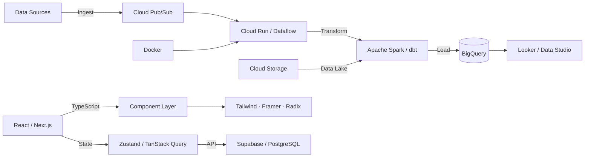

<div align="center">

<!-- PIXEL ART AVATAR -->
```
                    ██████████████
                ████░░░░░░░░░░░░████
            ████████████████████████████
            ██▓▓▓▓▓▓▓▓▓▓▓▓▓▓▓▓▓▓▓▓▓▓██        ← 🧢 Cap
            ██████████████████████████████
            ██░░░░░░░░░░░░░░░░░░░░░░░░██
            ██░░██████░░░░░░██████░░░░██        ← 👓 Glasses
            ██░░██▓▓██░░░░░░██▓▓██░░░░██
            ██░░██████░░░░░░██████░░░░██
            ██░░░░░░░░░░██░░░░░░░░░░░░██
            ██░░░░░░░░░░░░░░░░░░░░░░░░██
            ██░░░░▒▒▒▒▒▒▒▒▒▒▒▒▒▒░░░░░██        ← 🧔 Stubble
            ██░░░░░░████████████░░░░░░██
              ████░░░░░░░░░░░░░░░░░████
                  ████████████████
              ████░░░░░░░░░░░░░░░░████
            ██░░░░░░░░░░░░░░░░░░░░░░░░██        ← 👕 Casual
            ██░░░░░░░░░░░░░░░░░░░░░░░░██
```

<!-- ANIMATED TYPING SVG -->
<a href="https://git.io/typing-svg">
  
</a>

<br/>

<!-- SOCIAL BADGES -->
[](https://github.com/Eljosek)
[](https://instagram.com/eljosek)
[](https://linkedin.com/in/YOUR-LINKEDIN)
[](https://YOUR-PORTFOLIO.vercel.app)

</div>

---

## 🧑‍💻 About Me

```python
class JoseHerrera:
    def __init__(self):
        self.name        = "José Herrera"
        self.alias       = "Eljosek"
        self.university  = "Universidad Tecnológica de Pereira"
        self.degree      = "Ingeniería de Sistemas y Computación"
        self.focus       = [
            "Data Engineering & Cloud Pipelines",
            "Data Analytics & Business Intelligence",
            "Google Cloud Platform (GCP)",
            "Full-Stack Web Development",
        ]
        self.cloud       = "Google Cloud Platform ☁️"
        self.tools       = ["BigQuery", "Databricks", "Docker", "Apache Spark", "dbt"]
        self.currently   = "Building data pipelines & cloud-native apps on GCP"
        self.fun_fact    = "I automate ETL workflows before breakfast ☕"

    def say_hi(self):
        print("Thanks for stopping by! Let's build something data-driven 🚀")
```

> ☁️ **Systems Engineering student** focused on **Data Engineering**, **Analytics**, and **Google Cloud Platform**. I design robust data pipelines, transform raw data into actionable insights, and ship production-grade web apps — all powered by cloud-native tools.

---

## 🛠️ Tech Stack

<div align="center">

### ☁️ Cloud & Data Engineering


### 📊 Data & Analytics


### 🌐 Frontend


### 🔧 Backend & Database


### ⚡ DevOps & Tools


</div>

---

## ☁️ Google Cloud Focus

<div align="center">

```
┌──────────────────────────────────────────────────────────────────────┐
│                  ☁️  GCP DATA ENGINEERING STACK                     │
│                   Building Cloud-Native Pipelines                    │
├─────────────────┬──────────────────┬─────────────────────────────────┤
│  INGESTION      │  PROCESSING      │  STORAGE & ANALYTICS           │
│  ─────────────  │  ──────────────  │  ────────────────────────────  │
│  • Pub/Sub      │  • Dataflow      │  • BigQuery (DWH)              │
│  • Cloud Run    │  • Apache Spark  │  • Cloud Storage (Data Lake)   │
│  • Cloud Tasks  │  • Databricks    │  • Bigtable (real-time)        │
│  • APIs / REST  │  • dbt (models)  │  • Looker / Data Studio        │
├─────────────────┴──────────────────┴─────────────────────────────────┤
│  🐳 Docker  ·  Python  ·  SQL  ·  Pandas  ·  Apache Spark           │
└──────────────────────────────────────────────────────────────────────┘
```

</div>

---

## 🚀 Featured Projects

<div align="center">

### ☁️ Data & Algorithms

</div>

<table>
<tr>
<td width="50%">

### 🧮 [Linear Programming Toolkit](https://github.com/Eljosek/linear-programming-toolkit)
> **Complete Operations Research solver suite** built with Flask + NumPy

A production-ready web app implementing **6 optimization algorithms** from scratch:

- ✅ **Graphical Method** — LP visualization with Matplotlib
- ✅ **Simplex Tableau** — Full primal simplex with step-by-step
- ✅ **Dual Simplex** — Optimized for MAX/MIN problems
- ✅ **Two-Phase Simplex** — Handles artificial variables
- ✅ **Transportation Model** — Northwest Corner, Min Cost, Vogel (VAM)
- ✅ **Dijkstra & Kruskal** — Shortest path & MST algorithms


</td>
<td width="50%">

### 🛡️ [Seguros Prototipo — JH Digital Solutions](https://github.com/Eljosek/segurosprototipo)
> **Insurance Lead Management SaaS** — Full-stack production app

- 📊 Real-time **admin dashboard** with live Supabase subscriptions
- 📝 Lead capture with **Zod validation**
- 🔐 Full **Auth system** (login / signup / password recovery)
- 📈 Analytics with **Recharts** (pie charts, time series)
- 💬 WhatsApp integration & email service ready
- 🚀 **Deployed on Vercel**


</td>
</tr>
</table>

<div align="center">

### 🌐 Full-Stack Web Applications

</div>

<table>
<tr>
<td width="50%">

### 🛒 [ElectroEventos Store](https://github.com/Eljosek/electroeventos-store)
> **Modern e-commerce platform** with Next.js 15 & React 19

- 🛍️ Full shopping cart with **Zustand** state management
- 🎨 Animated UI with **Framer Motion**
- 📱 Fully responsive with **Tailwind CSS v4**
- ⚡ **Next.js 15** App Router & optimized images
- 🔄 Persistent cart with localStorage middleware


</td>
<td width="50%">

### 🌿 [Prototipo FUNCO](https://github.com/Eljosek/prototipofunco)
> **NGO/Foundation website** — Environmental-themed platform

- 🍃 Animated **falling leaves** & vine decorations
- 📊 Impact metrics & testimonials carousel
- 💬 **WhatsApp** floating button integration
- 🎭 Rich component library with Radix UI primitives
- ✨ Smooth animations via **Framer Motion**


</td>
</tr>
</table>

---

## 📊 GitHub Stats

<div align="center">


<br/>


<br/>

<!-- CONTRIBUTION SNAKE -->
<picture>
  <source media="(prefers-color-scheme: dark)" srcset="https://raw.githubusercontent.com/Eljosek/Eljosek/output/github-snake-dark.svg" />
  <source media="(prefers-color-scheme: light)" srcset="https://raw.githubusercontent.com/Eljosek/Eljosek/output/github-snake.svg" />
  
</picture>

</div>

---

## 🏗️ Architecture & Data Stack



---

## 📫 Let's Connect

<div align="center">

[](mailto:YOUR-EMAIL@example.com)

| 📧 Email | 💼 LinkedIn | 📸 Instagram | 🌐 Portfolio |
|:---:|:---:|:---:|:---:|
| [your.email@example.com](mailto:your.email@example.com) | [/in/your-linkedin](https://linkedin.com/in/YOUR-LINKEDIN) | [@eljosek](https://instagram.com/eljosek) | [portfolio.vercel.app](https://YOUR-PORTFOLIO.vercel.app) |

<br/>


<br/>


</div>

---

<div align="center">
  <sub>⚡ Built with passion at Universidad Tecnológica de Pereira 🇨🇴</sub>
  <br/>
  <sub>☁️ "Turning raw data into decisions, one pipeline at a time"</sub>
</div>
